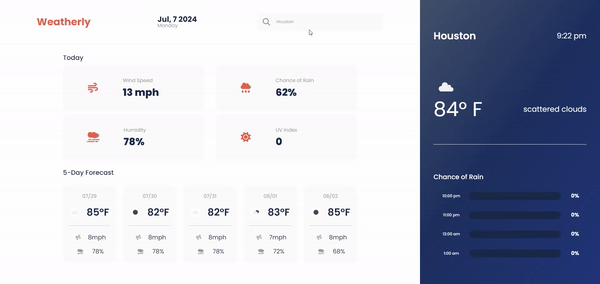

# Weatherly

## Welcome to Weatherly!

Your one-stop-shop for your current weather updates!

### How to use - 

Enter a city in the 'Search City" field located in the header. Once you submit a city, the page will populate with information regarding that city. To see your search history, simply click into the "Search City" field and it will appear beneath the search bar. If you make your way into the localStorage section of the Chrome Dev Tools, you will see the constantly updated key/value pair for searchHistory.

To check out the website, [click here!](https://drewheaster.github.io/weather-dashboard/)
